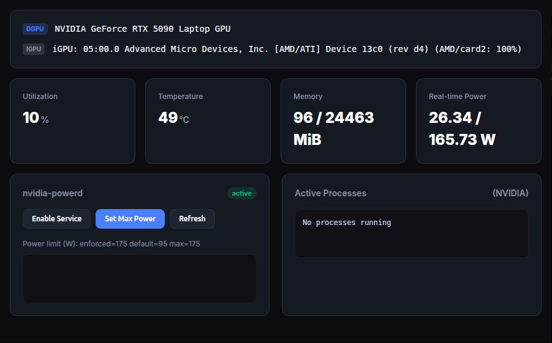

# ubuntu-gpu-gui

Lightweight GUI for monitoring GPU status on Ubuntu, with an entry point for setting power limits.

## Start

- Recommended: `./run.sh`

## Run / Debug

- VS Code Task: `Run ubuntu-gpu-gui`
- VS Code: `Debug ubuntu-gpu-gui (Wails)` (Run and Debug)

## Notes

- NVIDIA metrics require the NVIDIA driver and `nvidia-smi`
- iGPU utilization (if exposed by the system) will be shown automatically
- Power-related operations require admin privileges: prefer `pkexec`, otherwise `sudo -n`
